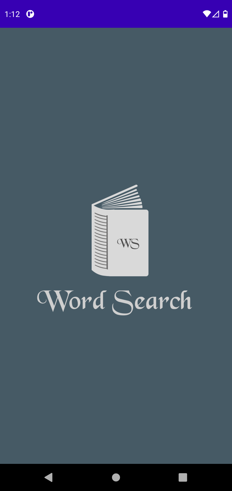
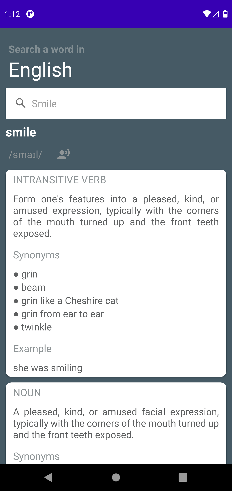
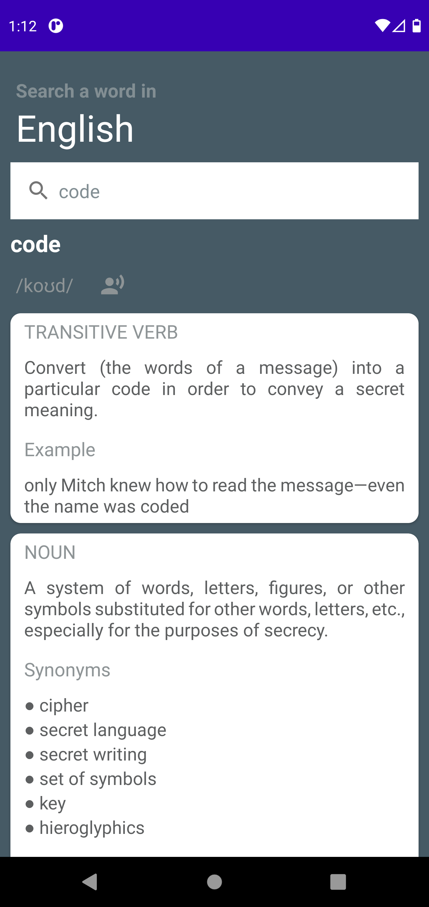

# WordSearch - Android App

[

](./readme/Project_WS_logo.png)

## About

Word Search is an Android application which helps to search meaning of the word. The application also provides functionality of Word Pronounciation which is clear, completely-natural, pre-recorded by native speakers.

Right now, I have provided functionality to search meaning of word in english only. Multiple languages meaning search functionality will be implemented soon as I get completed with my other projects.

This was my first app where I used Dependency Injection with Hilt

### [Video Demo](https://drive.google.com/file/d/1XNdG1sUWiuLTZ25kp54BHyhBvMaGihV_/view?usp=sharing)

## Screenshots

- Splash Screen  
  

- Default Smile Screen - Default Search letter is "smile" and "code" is searched word.  
  
  

## Libraries Used

- Retrofit
- Kotlin Coroutines
- Lifecycle
- Glide
- Hilt (Dependency Injection)

## Special thanks ❤️...

I would like to thank [meetDeveloper](https://github.com/meetDeveloper) for providing [Free Dictionary API](https://dictionaryapi.dev/) which helped me a lot to develop this application.
